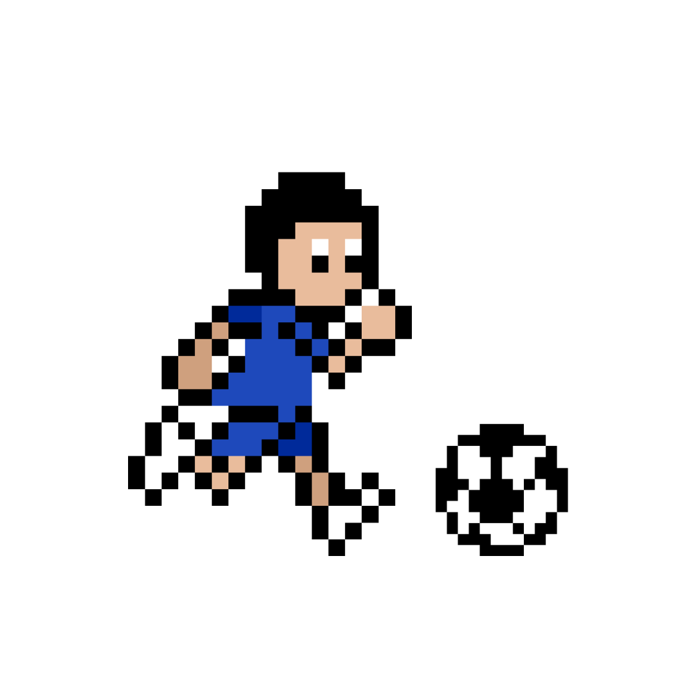

<h1>⚽ Desafio de Projeto: Football Duel Simulator</h1>

<table>
    <tr>
        <td>
            
        </td>
        <td>
            <b>Objetivo:</b>
            <p>
                Este projeto simula um confronto de futebol entre dois jogadores utilizando JavaScript.
                Cada atleta possui atributos próprios e disputa uma partida composta por 5 rodadas,
                onde diferentes situações de jogo são sorteadas para definir quem conquista mais pontos
                e vence o duelo.
            </p>
        </td>
    </tr>
</table>

## 👥 Jogadores

| Jogador | Velocidade | Chute | Drible |
|---------|-----------:|-------:|--------:|
| ⚽ Cristiano Ronaldo | 7 | 6 | 10 |
| ⚽ Messi | 6 | 7 | 10 |

---

## 🎮 Mecânicas do jogo

### Jogadores

- Cada jogador é representado por um objeto JavaScript.
- Cada objeto possui os seguintes atributos:
  - **Nome**
  - **Velocidade**
  - **Chute**
  - **Drible**
  - **Pontos**

---

### Rodadas

- A partida possui **5 rodadas**.
- Em cada rodada é sorteada uma situação de jogo:

| Situação | Atributo utilizado |
|----------|--------------------|
| 🏃 RETA | Velocidade |
| 🔄 CURVA | Drible |
| ⚔️ CONFRONTO | Chute |

---

### Como funciona

#### 🏃 RETA

- Cada jogador lança um dado de 6 lados.
- O resultado é somado ao atributo **Velocidade**.
- Quem obtiver o maior valor ganha **1 ponto**.

---

#### 🔄 CURVA

- Cada jogador lança um dado de 6 lados.
- O resultado é somado ao atributo **Drible**.
- Quem obtiver o maior valor ganha **1 ponto**.

---

#### ⚔️ CONFRONTO

- Cada jogador lança um dado de 6 lados.
- O resultado é somado ao atributo **Chute**.
- Quem obtiver o maior valor faz o adversário perder **1 ponto**.
- Nenhum jogador pode ficar com pontuação negativa.
- Em caso de empate, ninguém perde pontos.

---

## 🎲 Dados

Durante cada rodada:

- Cada jogador lança um dado de **6 lados**.
- O resultado do dado é somado ao atributo correspondente à situação sorteada.

Exemplo:

```
Cristiano Ronaldo 🎲 rolou um dado: 4 + Velocidade (7) = 11
Messi 🎲 rolou um dado: 6 + Velocidade (6) = 12
```

---

## 🏆 Condição de vitória

Ao final das 5 rodadas:

- Vence quem possuir a maior quantidade de pontos.
- Caso ambos terminem com a mesma pontuação, a partida termina empatada.

---

## 📂 Estrutura do projeto

```
📦 football-duel
 ├── index.js
 ├── README.md
 └── docs/
```

---

## 🚀 Como executar

1. Clone este repositório.

```bash
git clone <url-do-repositorio>
```

2. Entre na pasta do projeto.

```bash
cd football-duel
```

3. Execute com Node.js.

```bash
node index.js
```

---

## 🛠️ Tecnologias

- JavaScript (ES6+)
- Node.js

---

## 📖 Aprendizados

Neste projeto foram praticados conceitos como:

- Objetos
- Funções assíncronas (`async/await`)
- Estruturas condicionais
- Laços de repetição
- Geração de números aleatórios
- Organização da lógica de um jogo